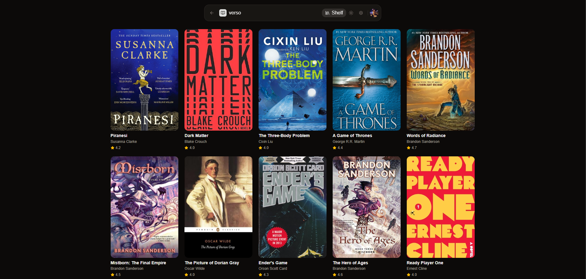

# Incipit

> Tinder for books. Swipe through titles, build your shelf, discover what to read next.



books that were swiped right get saved to your shelf: 


## Overview

Incipit is a full stack web app that lets you discover books through a swipe-based interface. Pick your genres, swipe right on books you want to read, and build a personal shelf over time. Built with a modern TypeScript stack and deployed on Vercel.

## Features

- **Swipe interface** — drag cards left to pass, right to save. LIKE/PASS indicators animate as you drag.
- **Genre-based feed** — picks genres during onboarding, feed rotates through them automatically.
- **Personal shelf** — all your saved books in one place, with the ability to remove any title.
- **Duplicate prevention** — books you've already swiped never appear again.
- **Auth** — sign up and sign in via Clerk with email or Google.

## Tech Stack

| Layer | Technology |
|---|---|
| Frontend | Next.js 15, TypeScript, Tailwind CSS |
| Animation | Framer Motion |
| Auth | Clerk |
| Database | Neon (Postgres) |
| ORM | Prisma 7 |
| Books Data | Google Books API |
| Deployment | Vercel |

## Getting Started

### Prerequisites

- Node.js 18+
- A [Neon](https://neon.tech) account
- A [Clerk](https://clerk.com) account
- A [Google Books API](https://console.cloud.google.com) key

### Installation

```bash
git clone https://github.com/bhavv04/incipit.git
cd incipit
npm install
```

### Environment Variables

Create a `.env` file in the project root:

```env
# Clerk
NEXT_PUBLIC_CLERK_PUBLISHABLE_KEY=
CLERK_SECRET_KEY=
NEXT_PUBLIC_CLERK_SIGN_IN_URL=/sign-in
NEXT_PUBLIC_CLERK_SIGN_UP_URL=/sign-up
NEXT_PUBLIC_CLERK_AFTER_SIGN_IN_URL=/app
NEXT_PUBLIC_CLERK_AFTER_SIGN_UP_URL=/app

# Neon
DATABASE_URL=""

# Google Books
GOOGLE_BOOKS_API_KEY=

#Hardcover API
HARDCOVER_API_KEY=
# no need for `bearer` for hardcover api key 
```

### Database Setup

```bash
npx prisma db push
npx prisma generate
```

### Run Locally

```bash
npm run dev
```

Open [http://localhost:3000](http://localhost:3000).

## Project Structure

```
src/
├── app/
│   ├── (auth)/
│   │   ├── sign-in/[[...sign-in]]/page.tsx
│   │   └── sign-up/[[...sign-up]]/page.tsx
│   ├── api/
│   │   ├── books/route.ts        # Google Books API proxy + swipe filtering
│   │   ├── shelf/route.ts        # GET and DELETE shelf books
│   │   ├── swipe/route.ts        # Record swipes, save liked books
│   │   ├── user/route.ts         # Upsert user on login
│   │   └── onboarding/route.ts   # Save genre preferences
│   ├── onboarding/page.tsx
│   ├── shelf/page.tsx
│   └── page.tsx                  # Main swipe UI
├── components/
│   ├── BookCard.tsx              # Draggable card with LIKE/PASS overlay
│   ├── SwipeStack.tsx            # Animated card stack
│   └── GenrePicker.tsx           # Genre selection pills
└── lib/
    ├── prisma.ts                 # Prisma client singleton
    └── books.ts                  # Google Books API helper
```

## Roadmap

### In Progress
- [x] Deploy to Vercel

### Planned
- [ ] **AI recommendations** — Claude API generates a personalised "why you'd like this" blurb based on swipe history
- [ ] **Shelf filters** — filter saved books by genre, rating, or date added
- [x] **Onboarding redirect** — detect new users and route them to onboarding before the feed
- [ ] **Reading status** — mark books as "want to read", "reading", or "finished"
- [x] **Book detail modal** — tap a card to expand full description, page count, and publication info

### Future Ideas
- [ ] **Friends & social** — follow friends, see what they're reading
- [ ] **Weekly picks** — curated stack of 10 books refreshed every Monday
- [ ] **Export shelf** — download your shelf as a CSV or sync to Goodreads
- [ ] **PWA support** — install as a mobile app

## Acknowledgments

Background photo by [Peter Herrmann](https://unsplash.com/@tama66) on [Unsplash](https://unsplash.com/photos/a-room-with-a-lot-of-books-in-it-O_DUcg4cDlc)